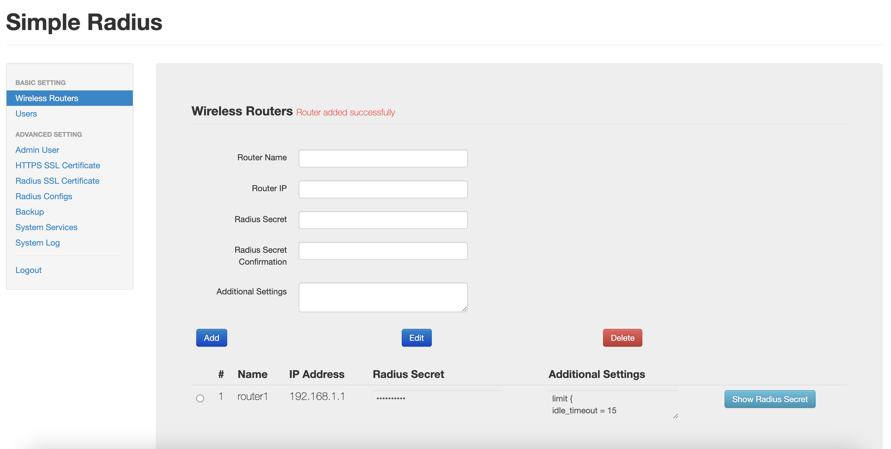
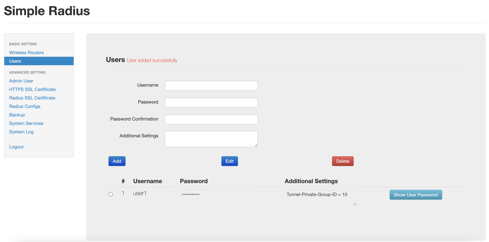

# SimpleRadius

This project aim to create a simple radius server so anyone can use it to turn any home wifi into an enterprise wifi (WPA2/WPA3 Enterprise) in 3 simple steps.

1. Add Router Info in SimpleRadius

  
2. Add User Info in SimpleRadius

  
3. Add Radius Info in Your Router

### Usage via Docker

1. Run the following command to start the container:
```sh
docker run -it -d -p 443:443 -p 1812:1812 -p 1812:1812/udp maxchen021/simpleradius
```
  
2. Use your browser to access https://(hostname/ip)
   * Credential: admin/password

### Data Persistence
For data persistence, you just need to make sure that you mount a host volume for the "/etc/SimpleRadius/database" directory such as:
```sh
docker run -it -d -v "$(pwd)"/SimpleRadius:/etc/SimpleRadius/database -p 443:443 -p 1812:1812 -p 1812:1812/udp maxchen021/simpleradius
```
This also apply to kubernetes. You just need to create a persistence storage volume and use that to mount "/etc/SimpleRadius/database"